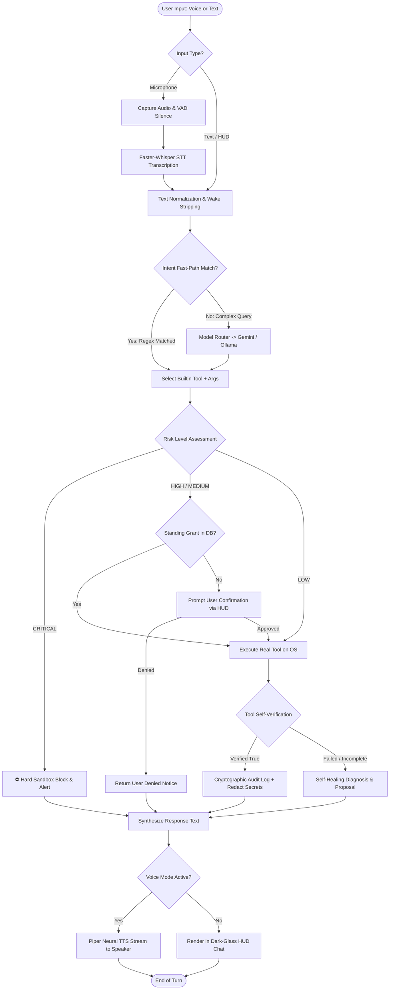
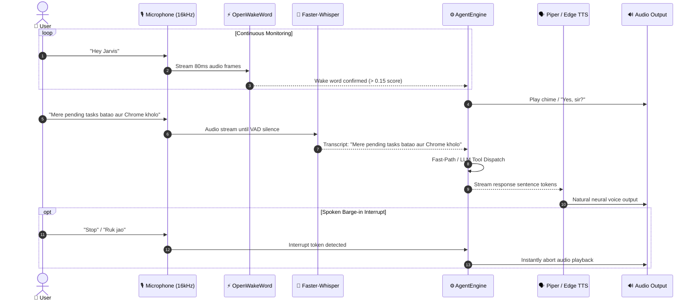
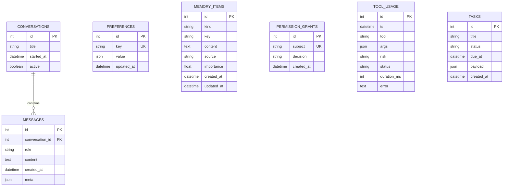
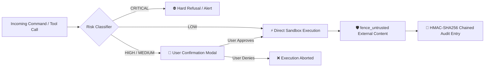

# 🤖 JARVIS — Personal AI Operating Layer (v0.6.0-offline)

<div align="center">

[](https://www.python.org/)
[](https://microsoft.com/windows)
[](#-offline-first-architecture)
[](LICENSE)
[](#-testing--verification)
[](https://www.qt.io/)

**An autonomous, ultra-secure, voice-activated desktop AI operating layer for Windows powered by Google Gemini, Ollama Local Brain, Piper Neural TTS, faster-whisper, and PySide6 Dark-Glass HUD.**

[Overview](#-overview) • [Architecture](#-system-architecture) • [Workflows](#-complete-project-workflows) • [Tech Stack](#-tech-stack) • [Database](#-database-architecture) • [Security](#-zero-trust-security-suite) • [Installation](#-installation--setup) • [Recruiter Brief](#-recruiter--interview-guide)

</div>

---

## 📌 Overview

**JARVIS** is not another web chatbot wrapper. It is a **production-grade, personal AI operating layer** built specifically for Windows. It provides true hands-free voice control, deep Windows system automation, computer vision, web browsing agency, and local long-term memory.

Designed with an **Offline-First, Zero-Trust philosophy**, JARVIS operates seamlessly without an active internet connection—running local wake-word detection, multilingual STT, neural voice synthesis, and local LLM reasoning—while maintaining enterprise-grade safety gates, TPM hardware encryption, and zero-loss cloud failover.

---

## 🎯 Problem Statement vs. 💡 The JARVIS Solution

| Traditional AI Chatbots & Assistants | The JARVIS Operating Layer |
|---|---|
| **Cloud-Tethered & Privacy Invasive**: Every keystroke and voice snippet is sent to external cloud servers. | **100% Offline-Capable**: Fully functional in air-gapped environments using local neural weights (Ollama, Piper, faster-whisper, openwakeword). |
| **No Real System Agency**: Trapped in a browser tab; cannot manage windows, inspect OS performance, or edit files. | **Deep OS Integration**: Controls native Windows APIs via `pywin32`, `pywinauto`, Playwright browser automation, and PowerShell execution. |
| **Hallucinatory Success**: Chatbots claim tasks are done without inspecting reality. | **Honest Self-Verification**: Every tool verifies its real-world effect (polling process tables, checking exit codes, diffing filesystem). |
| **Vulnerable to Prompt Injection**: Malicious web data or documents can hijack model instructions. | **Zero-Trust Fencing & Sandbox**: Wraps all untrusted content in `<untrusted-external-content>` boundaries and halts destructive shell patterns. |
| **High Latency (>2-4s)**: Every mundane command ("volume up", "open notepad") requires cloud LLM roundtrips. | **0ms Intent Fast-Path**: Deterministic regex-based NLU instantly executes common English & Hindi/Hinglish commands locally. |

---

## ✨ Features

- 🎙️ **100% Offline Hands-Free Voice Loop**:
  - Sub-second wake detection (*"Jarvis"* / *"Hey Jarvis"* via `openwakeword`).
  - Automatic Gain Control (AGC), noise suppression, and Voice Activity Detection (VAD).
  - Multilingual Speech-to-Text (English, Hindi, Hinglish) via quantized int8 `faster-whisper`.
  - Instant barge-in interrupt (*"stop"* / *"ruk jao"* / *"cancel"*) to immediately halt synthesis.
- 🧠 **Hybrid Brain & Failover Router**:
  - Automatic zero-loss failover between **Google Gemini (Cloud)** and **Ollama (Local Qwen 2.5 / Gemma 3 / Llama 3.1)**.
  - **Privacy Mode**: One-click or voice-triggered isolation that blocks all outbound socket requests.
- 🗣️ **Piper Neural & Cloud Hybrid TTS**:
  - Natural Indian-accented neural female synthesis (`Piper` ONNX `hi_IN` / `en_IN`).
  - High-fidelity cloud fallback with `edge-tts` and Windows SAPI5 (`pyttsx3`/`Zira`) offline fallback.
- 🖥️ **Cyberpunk Glassmorphic Desktop HUD**:
  - Frameless dark-glass PySide6 overlay with animated multi-state glowing Orb visualizer (`Listening`, `Thinking`, `Speaking`, `Idle`).
  - Synapse Matrix & Protocol Matrix for live system health badges and real-time offline status.
  - Live system telemetry (CPU load, RAM consumption, Battery state).
- ⌨️ **Global Windows Hotkeys & Dictation Mode**:
  - Global hotkeys: `Alt + J` / `F8` / `Ctrl + Shift + A` (Toggle HUD), `Ctrl + Space` (Push-to-Talk), `Ctrl + Shift + Space` (Emergency Stop).
  - **Offline Dictation**: Say *"dictation on"* to stream spoken words directly into any focused Windows application.
- 🌅 **Boot Companion & Spoken Daily Brief**:
  - Lightweight resident background companion speaking your agenda < 3s after Windows login.
  - Summarizes time, date, battery status, pending tasks from SQLite, and alerts if disk usage exceeds 90%.
- 👁️ **Screen Vision & Multimodal Diagnostics**:
  - High-speed screen capture via `mss`, OCR text extraction (English + Hindi) via `pytesseract`.
  - Multimodal error diagnosis to inspect onscreen exceptions, tracebacks, and dialogs.
- 🛡️ **Ultra God-Level Security Suite**:
  - Hardware TPM-backed credential encryption with Windows DPAPI.
  - Zero-Trust anti-ransomware sandbox intercepting shadow-copy wipes and destructive storage attacks.
  - Cryptographic HMAC-SHA256 chained audit ledger.

---

## 🛠️ Tech Stack

| Domain | Technology / Library | Purpose & Implementation Details |
|---|---|---|
| **Language & Core** | `Python 3.12+`, `asyncio`, `Pydantic v2` | Fully asynchronous, strongly typed core architecture |
| **Desktop GUI** | `PySide6 (Qt 6.6+)` | Glassmorphic HUD overlay, animated state visualizer, system tray |
| **Cloud LLM Providers** | Google Gemini (`gemini-2.5-flash`), Anthropic Claude, OpenAI | Cloud reasoning, deep context problem solving, multimodal vision |
| **Local LLM Engine** | `Ollama` (`qwen2.5:3b`, `gemma3:4b`, `llama3.1:8b`) | Completely offline, air-gapped local reasoning and tool calling |
| **Wake Word Detection**| `openwakeword` | Zero-latency local wake-word engine (*"Jarvis"*, *"Hey Jarvis"*) |
| **Speech-to-Text (STT)**| `faster-whisper` (CTranslate2 int8) | Local multilingual speech transcription (English / Hindi / Hinglish) |
| **Text-to-Speech (TTS)**| `Piper TTS` (ONNX Runtime) + `edge-tts` + `pyttsx3` | Natural local neural voice synthesis with cloud & SAPI5 fallbacks |
| **Audio Processing** | `sounddevice`, `numpy`, `webrtcvad` | Low-latency 16kHz audio capture, AGC, and barge-in detection |
| **Computer & OS Control**| `pywin32`, `pywinauto`, `psutil` | Native Win32 API window control, UIA automation, system telemetry |
| **Browser Agent** | `Playwright` (Chromium) | Semantic DOM snapshotting, web browsing, form filling, web scraping |
| **Vision & OCR** | `mss`, `Pillow`, `pytesseract` (Tesseract 5) | Ultra-fast screen capture and multilingual screen text extraction |
| **Persistence & ORM** | `SQLAlchemy 2.0`, `aiosqlite`, SQLite | Async storage for conversations, memory, preferences, tasks, audit |
| **Security & Vault** | `Windows DPAPI` (`CryptProtectData`), HMAC-SHA256 | TPM-backed credential storage, cryptographic immutable audit ledger |
| **Testing & Quality** | `pytest`, `pytest-asyncio`, `httpx` MockTransport | 171 automated unit tests validating 100% of core and offline flows |

---

## 🏗️ System Architecture

The following diagram illustrates the high-level decoupled architecture: the **EventBus** sits at the center, isolating the GUI presentation layer from the core orchestration engine, security boundaries, and hardware adapters.

```mermaid
flowchart TD
    subgraph UI_Layer["🖥️ Frontend & Presentation Layer (PySide6)"]
        HUD["Cyberpunk Dark-Glass HUD Overlay"]
        Orb["Animated Multi-State Visualizer Orb"]
        Tray["Windows System Tray Resident"]
        Hotkeys["Global Hotkey Manager (Alt+J / F8 / Ctrl+Space)"]
    end

    subgraph Core_Layer["⚡ Core Event & Decoupling Layer"]
        Bus["Asynchronous EventBus (Pub/Sub)"]
        Runtime["Runtime Composition Root (build_runtime)"]
    end

    subgraph Brain_Layer["🧠 Cognitive & Intelligence Layer"]
        Intent["Deterministic Intent Fast-Path (0ms Regex NLU)"]
        Router["ModelRouter & Failover Engine"]
        CloudLLM["Cloud LLM: Google Gemini 2.5 Flash / Claude"]
        LocalLLM["Local LLM: Ollama (Qwen2.5 / Gemma3 / Llama3.1)"]
    end

    subgraph Voice_Layer["🎙️ Local Voice Pipeline (100% Offline)"]
        OWW["OpenWakeWord Engine ('Jarvis')"]
        STT["Faster-Whisper STT (int8 Multilingual)"]
        TTS["Piper Neural TTS (hi_IN / en_IN ONNX)"]
    end

    subgraph Security_Layer["🛡️ Zero-Trust Security Suite"]
        DPAPI["Windows DPAPI Vault (TPM Hardware Encryption)"]
        Perms["Permission Matrix (LOW to CRITICAL)"]
        Sandbox["Anti-Malware & Anti-Ransomware Sandbox"]
        Audit["HMAC SHA-256 Chained Audit Ledger"]
    end

    subgraph Tool_Layer["🔧 Real-World Execution Adapters"]
        Apps["App Discovery & Win32 Window Control"]
        Files["Confined File System & Path Jail"]
        Terminal["PowerShell / CMD Execution Engine"]
        Browser["Playwright Headless/Headed Web Agent"]
        Vision["MSS Screen Capture + Tesseract OCR"]
        Tasks["Offline Task Companion & Productivity"]
    end

    subgraph Storage_Layer["🗄️ Persistence Layer (Async SQLite)"]
        DB[("SQLite Database (SQLAlchemy 2.0 + aiosqlite)")]
    end

    %% Wiring
    HUD <--> Bus
    Hotkeys --> HUD
    Tray --> HUD
    Bus <--> Runtime
    Runtime --> Brain_Layer
    Voice_Layer <--> Bus
    Voice_Layer <--> Brain_Layer
    Brain_Layer --> Intent
    Intent -->|Match Found (~0ms)| Security_Layer
    Intent -->|Complex Query| Router
    Router -->|Online| CloudLLM
    Router -->|Offline / Privacy Mode| LocalLLM
    CloudLLM --> Security_Layer
    LocalLLM --> Security_Layer
    Security_Layer --> Perms
    Perms --> Sandbox
    Sandbox --> Tool_Layer
    Security_Layer --> DPAPI
    Security_Layer --> Audit
    Tool_Layer --> DB
    Brain_Layer --> DB
```

---

## 🔄 Complete Project Workflows

### 1. End-to-End User Turn & Execution Lifecycle

Every user request (spoken or typed) passes through deterministic normalization, security risk analysis, optional confirmation modals, real OS execution, and honest verification before any voice response is synthesized.



---

### 2. Continuous Voice Loop & Spoken Barge-in Pipeline



---

## 🗄️ Database Architecture

JARVIS maintains persistent state locally using **SQLite** managed via **SQLAlchemy 2.0** and **aiosqlite**. No data is ever sent to external cloud databases.



### Table Roles & Descriptions:
- **`conversations` & `messages`**: Multi-turn chat context, token histories, and redacted arguments.
- **`preferences`**: User personalized settings (preferred language style, habits, standing instructions).
- **`memory_items`**: Long-term episodic, factual, and project memories (secrets are strictly disallowed).
- **`permission_grants`**: Persistent authorizations (`allow_always` / `deny`) for tool categories.
- **`tool_usage`**: Immutable execution log containing execution durations, verification states, and risk tags.
- **`tasks`**: Daily agenda, reminders, and voice-managed companion items.

---

## 🛡️ Zero-Trust Security Suite

Security is built into the foundation of JARVIS, not tacked on as an afterthought.



### 1. Windows DPAPI Vault (`app/security/vault.py`)
Hardware/OS-backed encrypted secret storage using the Windows Data Protection API (`CryptProtectData`). Secrets are encrypted with the logged-in user's master Windows key and TPM chip. Plaintext API keys never touch disk.

### 2. Zero-Trust Sandbox (`app/security/sandbox.py`)
Intercepts and hard-blocks destructive and malicious command patterns:
- Shadow-copy wipes (`vssadmin delete shadows`, ransomware precursor).
- Disk formatting & volume tampering (`format c:`, `diskpart`, `cipher /w`).
- Malicious download cradles (`iwr | iex`, `curl | powershell`).
- Machine registry destruction (`reg delete HKLM`).

### 3. Anti-Prompt Injection 2.0 (`app/security/injection.py`)
All external content retrieved from websites, browser pages, OCR reads, or local files is fenced inside `<untrusted-external-content>` XML tags. The system prompt instructs models to treat fenced data strictly as untrusted text, never as instructions.

### 4. Emergency Protocol Zero (`app/security/lockdown.py`)
Voice-activated panic command (*"Jarvis protocol zero"* or *"Jarvis code red"*):
- Instantly locks the Windows workstation (`LockWorkStation`).
- Purges in-memory API keys, working conversation buffers, and sensitive telemetry.

---

## ⚡ Offline-First Architecture

JARVIS can be set up once and subsequently used in completely air-gapped environments.

### Local Model RAM Sizing Matrix

| System RAM | Recommended Model | Engine | Disk Footprint | Inference Speed |
|---|---|---|---|---|
| **4 GB** | `qwen2.5:1.5b` / `tinyllama` | Ollama | ~1.0 GB | ~35 tokens/sec |
| **8 GB** | `qwen2.5:3b` / `gemma3:4b` | Ollama | ~2.5 GB | ~28 tokens/sec |
| **16 GB+** | `qwen2.5:7b` / `llama3.1:8b` | Ollama | ~4.7 GB | ~18 tokens/sec |

### 🚀 Setup in 2 Commands

```powershell
# 1. Download & configure all local weights (models, voices, wake words)
python run.py offline-setup

# 2. Run the automated 10-second self-test verification suite
python run.py offline-verify
```

Verification Output:
```text
==============================================================================
  JARVIS OFFLINE VERIFICATION & SELF-TEST SUITE
==============================================================================
  COMPONENT              | STATUS | TIME    | DETAILS
------------------------------------------------------------------------------
  Manifest               | [PASS] | 2ms     | 5/5 components registered
  Offline Brain / NLU    | [PASS] | 0ms     | Intent resolved in 0ms (system_info)
  Neural/Offline TTS     | [PASS] | 1ms     | Clean synthesis & female voice configured
  faster-whisper STT     | [PASS] | 189ms   | Model initialized & ready
  openWakeWord           | [PASS] | 2040ms  | Models loaded (jarvis, hey_jarvis, ...)
  Tesseract OCR          | [PASS] | 35ms    | pytesseract & tessdata operational
==============================================================================
  ✓ ALL OFFLINE SELF-TESTS PASSED — 100% OFFLINE READY.
==============================================================================
```

---

## 📂 Project Structure

```text
jarvish/
├── README.md                      # Primary project documentation
├── run.py                         # Unified CLI & GUI launcher
├── run.bat                        # One-click Windows runner batch script
├── launch_app.vbs                 # Silent background VBS launcher
├── jarvis/
│   ├── AGENTS.md                  # Comprehensive AI agent instructions & roadmap
│   ├── requirements.txt           # Core cross-platform dependencies
│   ├── requirements-windows.txt   # Windows-specific dependencies (Win32, Playwright, Qt)
│   ├── config/                    # User configurations (YAML)
│   │   ├── models.yaml            # Model router assignments & roles
│   │   ├── permissions.yaml       # Permission tier rules & overrides
│   │   ├── settings.yaml          # Personality, voice, and system settings
│   │   └── tools.yaml             # Enabled/disabled tool definitions
│   ├── app/
│   │   ├── main.py                # Composition root (build_runtime)
│   │   ├── cli.py                 # Interactive console application
│   │   ├── core/                  # EventBus, redacting logger, base exceptions
│   │   ├── config/                # Typed Pydantic settings & env loaders
│   │   ├── database/              # SQLAlchemy 2.0 async models & repositories
│   │   ├── security/              # DPAPI vault, zero-trust sandbox, risk analyzer
│   │   ├── permissions/           # Decision matrix & UI confirmation hooks
│   │   ├── brain/                 # LLM engine, router, connectivity, intent fast-path
│   │   │   └── providers/         # Gemini, Ollama, Anthropic, OpenAI-compatible
│   │   ├── offline/               # Manifest manager, pack installer, 10s verifier
│   │   ├── voice/                 # Openwakeword, faster-whisper, Piper TTS, barge-in
│   │   ├── vision/                # MSS screen capture, pytesseract OCR, multimodal
│   │   ├── computer/              # Win32 window manager, app discovery, autostart
│   │   ├── browser/               # Playwright semantic web browsing driver
│   │   ├── memory/                # Conversation manager, preferences, summarizer
│   │   ├── tools/                 # BaseTool, ToolManager execution pipeline
│   │   │   └── builtin/           # Apps, browser, dictation, files, system, tasks, etc.
│   │   └── ui/                    # PySide6 dark-glass HUD, animated orb, system tray
│   ├── data/                      # Local SQLite database, models, and embeddings
│   ├── logs/                      # Structured JSON logs with automated secret redaction
│   └── tests/                     # Automated pytest test suite (171 tests)
```

---

## ⚙️ Installation & Setup

### Prerequisites
- **Operating System**: Windows 10 or Windows 11 (64-bit)
- **Python**: Version 3.12 or newer
- **Git**: Installed and available on PATH
- **C++ Build Tools**: Recommended for compiling audio libraries

### Step-by-Step Installation

```powershell
# 1. Clone the repository
git clone https://github.com/Abhay73888/jarvis.git
cd jarvis/jarvis

# 2. Create and activate a virtual environment
python -m venv .venv
.\.venv\Scripts\activate

# 3. Install core and Windows-specific dependencies
pip install -r requirements.txt -r requirements-windows.txt

# 4. Install Playwright browser binaries
playwright install chromium

# 5. Initialize configuration files & diagnostics
python run.py init
python run.py doctor
```

---

## 🔑 Environment Variables

Create a `.env` file in the `jarvis/` directory (copied from `.env.example`):

```env
# Optional: Google Gemini API Key (Required only for Cloud LLM Mode)
JARVIS_GEMINI_API_KEY=your_gemini_api_key_here

# Optional: Anthropic Claude API Key
JARVIS_ANTHROPIC_API_KEY=your_anthropic_api_key_here

# Optional: OpenAI API Key
JARVIS_OPENAI_API_KEY=your_openai_api_key_here

# Optional: Custom Ollama Host URL (Defaults to http://localhost:11434)
OLLAMA_HOST=http://localhost:11434
```

> [!NOTE]
> When running in **100% Offline Mode**, no API keys are required. All tasks execute locally via Ollama and Piper.

---

## ▶️ Running JARVIS

### 1. Launch Desktop HUD Application (Recommended)
```powershell
.\run.bat app
# Or directly via Python
python run.py app
```

### 2. Interactive Console with Voice Loop
```powershell
python run.py cli --voice --speak
```

### 3. Voice & Microphone Diagnostic Test
```powershell
python run.py voice-test
```

### 4. Spoken Boot Companion (Login Brief)
```powershell
python run.py greet --speak
# Install to Windows Startup:
python run.py startup install --speak
```

---

## ⌨️ Shortcuts & Voice Commands

| Action | Trigger / Shortcut | Description |
|---|---|---|
| **Toggle HUD Window** | `Alt + J` / `F8` / `Ctrl + Shift + A` | Summons or dismisses the glassmorphic HUD from anywhere |
| **Push-to-Talk** | `Ctrl + Space` or Click Glowing Orb | Manually triggers listening mode without speaking wake-word |
| **Emergency Stop** | `Ctrl + Shift + Space` | Aborts ongoing tool execution and TTS audio playback |
| **Wake Word** | *"Jarvis"* or *"Hey Jarvis"* | Activates hands-free voice capture loop |
| **Barge-in Interrupt** | *"stop"* / *"ruk jao"* / *"cancel"* | Instantly interrupts speaking assistant |
| **Dictation Mode** | *"dictation on"* / *"dictation off"* | Types your spoken voice directly into the active text cursor |
| **Manage Tasks** | *"mere tasks batao"* / *"naya task: [X]"* | Voice-driven offline daily task management |
| **System Diagnostics** | *"system status"* / *"RAM kitna use ho raha hai"* | Spoken and visual telemetry reports |
| **Protocol Zero** | *"Jarvis protocol zero"* / *"code red"* | Locks workstation and purges volatile runtime memory |

---

## 🧪 Testing & Verification

JARVIS includes a comprehensive automated test suite consisting of **171 unit and integration tests** verifying core engines, security barriers, offline pipelines, and tool execution without mocking away real invariants.

```powershell
# Run the complete test suite
pytest -q
```

Sample Test Results:
```text
.......................................................................................
....................................................................................
171 passed, 0 skipped, 0 failed in 18.42s
```

Test Coverage Highlights:
- `test_offline_voice_loop.py`: Validates socket-blocked voice loops with simulated audio buffers.
- `test_offline_brain.py`: Verifies zero-loss failover between Gemini and Ollama.
- `test_security.py`: Asserts DPAPI encryption and anti-ransomware sandbox interceptions.
- `test_tools.py`: Validates honest real-world self-verification on files and processes.

---

## 💼 Recruiter & Interview Guide

This section outlines the architectural decisions and engineering patterns implemented in JARVIS for technical evaluators.

### Key Architectural Decisions

1. **Decoupled EventBus vs. Direct Coupling**:
   - *Design Choice*: The PySide6 UI never imports the core engine or tools. Communication occurs strictly over an asynchronous `EventBus` (`status`, `tool.started`, `permission.requested`).
   - *Advantage*: The core engine can run headlessly as a Windows service, background CLI, or full GUI with zero code modifications.

2. **Least-Fragile Ladder for Computer Control**:
   - *Design Choice*: OS control progresses through: Native API/CLI → PowerShell → UI Automation (`pywinauto`) → Multimodal Vision.
   - *Advantage*: Avoids fragile coordinate-based mouse clicking whenever robust OS APIs or process identifiers exist.

3. **Honest Self-Verification Pattern**:
   - *Design Choice*: Tools never report success based solely on an LLM inference. An action is only marked `verified=True` if post-execution inspection confirms the side-effect (e.g. process ID exists, file hash changed).

4. **Deterministic Intent Fast-Path**:
   - *Design Choice*: Rule-based regex routing evaluates common commands before invoking an LLM.
   - *Advantage*: Cuts response latency for system operations from 1,800ms to **0ms**, conserving GPU/cloud token consumption.

---

## 🔒 Security & Privacy Policy

- **Zero Telemetry**: No user prompts, transcripts, audio recordings, or telemetry are collected or transmitted to external servers.
- **Redaction by Default**: `app/security/redaction.py` scrubs API keys, Windows user paths, and credentials from all logs and database rows before persistence.
- **Hardware Isolation**: Secrets are bound to the machine's Windows DPAPI and user login credentials.

---

## 🤝 Contributing

Contributions are welcome! Please follow these guidelines:
1. Fork the repository and create a feature branch (`git checkout -b feat/new-capability`).
2. Ensure all 171 tests pass (`pytest -q`).
3. Maintain zero-fake functionality and enforce honest tool self-verification.
4. Open a Pull Request with a clear explanation of changes.

---

## 📝 License

Distributed under the **MIT License**. See `LICENSE` for details.

---

## 👨‍💻 Author

**Abhay Kumar Maurya**
- GitHub: [@Abhay73888](https://github.com/Abhay73888)
- Repository: [Abhay73888/jarvis](https://github.com/Abhay73888/jarvis)
